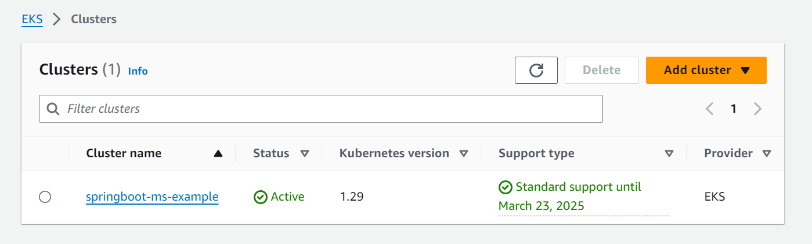
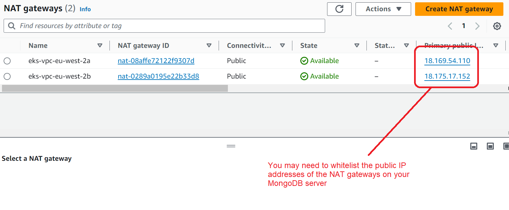
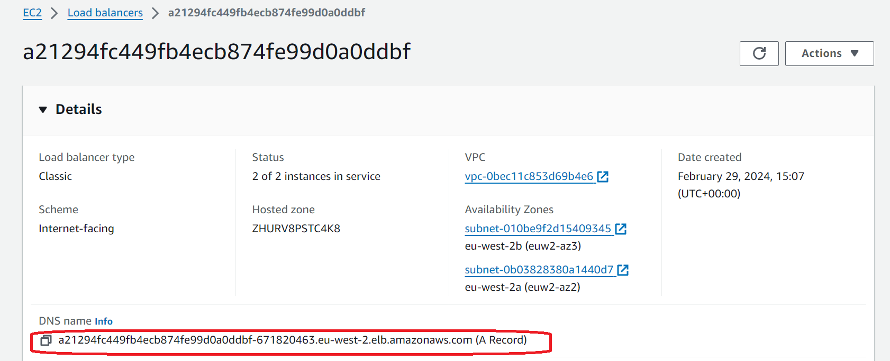

# Containerised Spring Boot microservice 102

Following on from [our first steps](readme.md) the next stage is to use an infrastructure as code tool to create and run a kubernetes cluster in the cloud.
We will use Terraform and AWS EKS to achieve this.

## Prerequisites
To go through this demo, you will need;

- An AWS account
- Terraform
- AWS CLI

Note that walking through the demo will cost money, but it should only be pennies.

### Step 1 - AWS Account
If you don't have one, create a new AWS account. You will have to provide payment details, but this demo will cost very little in cloud fees unless you accidentally forget to shut it down.
I strongly recommend putting billing alerts and budgets onto any personal account to avoid unexpected suprises. Don't forget to add MFA to the root account.

Next create an IAM user for Terraform to access AWS resources. It will need an access key, but not a password nor console access as it won't be signing in.
Add permissions policies to the user as follows;
- AmazonEC2FullAccess
- AmazonEKSClusterPolicy
- AmazonEKSServicePolicy
- AmazonVPCFullAccess
- AWSKeyManagementServicePowerUser
- CloudWatchLogsFullAccess
- IAMFullAccess

You should also add permissions for EKS administration (an allow on eks:*) and Systems Manager Get Parameters (an allow on ssm:GetParameters).

### Step 2 - Terraform setup
Download and install Terraform from Hashicorp. It's pretty simple.

### Step 3 - AWS CLI setup
Download and install the AWS CLI. You will need to configure it with some settings using the command

```bash
$ aws configure
```

which will prompt you for;

1. Your access key id
2. Your access key secret
3. The default region you want to use, eg eu-west-2

### Step 4 - Deploy using Terraform
The next step is joyfully simple. As all the required AWS infrastructure is defined in Terraform files,
we can simply run terraform and let it do the hard work for us. In the `/terraform` directory, first run the command;

```bash
$ terraform init
```

to initialise and download the dependencies. Then run;

```bash 
$ terraform plan
```

to get Terraform to analyse the required work. The plan step looks at the current state and determines what actions are
needed to move to the state declared in the `.tf` files. The first time you run a plan, it should detect that everything
is missing, so the plan will have many changes. To execute the plan, run;

```bash
$ terraform apply
```

then type `yes` to confirm execution. It will start applying the changes, which will take several minutes. Whilst those
changes are in progress, lets take a look at what is being deployed.

I have created three main `.tf` files to aid organisation, but the apply will look at all the `.tf` files in the directory. 

`terraform.tf` defines our provider and dependencies. Its just boilerplate - no actual resources are defined here.

`network.tf` defines the network that our EKS cluster will use. We define a VPC with two private subnets.
We enable a NAT & VPN gateway and enable DNS hostnames, which are required by EKS. The file uses the `terraform-aws-modules/vpc/aws` module
, which is a blueprint for a VPC with many default settings. Using this module saves us from defining a lot of individual resources.

`eks.tf` defines the EKS cluster we want to create. We give the cluster name and Kubernetes version, and pass the VPC and subnet details
from the other definition. We also specify the default AMI of `AL2_x86_64` to use for nodes created in the cluster. Finally we specify one
managed node group called `node-group-1` with a desired size of 2 nodes, using `t3.small` instances. Again, we are using a pre-built module
to make things simple, otherwise we'd have to manually define a lot of component resources.

Check your Terraform job has completed successfully, and you should be able to see in the AWS console that the EKS cluster has been created,
but there is nothing yet deployed to it, apart from the control plane assets, which are automatically managed by EKS.



### Step 5 - Apply the Kubernetes manifests
We can use `kubectl` as before to deploy the containers to our new cluster, but first we need a little extra config.
We need to make `kubectl` aware of the new cluster so it can talk to it, rather than working with the minikube cluster we
ran locally in the last step. This is made easy by the AWS CLI; run the command;

```bash
$ aws eks update-kubeconfig --region eu-west-2 --name springboot-ms-example
```

You can check that the new context has been added with;

```bash
$ kubectl config view
```

Now you can apply the 3 manifest files to deploy the application (make sure to run from the `/kube` directory);

```bash
$ kubectl apply -f cartms-mongo-secret.yaml
$ kubectl apply -f cartms-deployment-local.yaml
$ kubectl apply -f cartms-service.yaml
```

Again it will take a short while for the cluster to propogate these changes. Perhaps time for another cup of tea.
Remember that the MongoDB is external, so if you have network access controls, you will need to whitelist the AWS IPs for incoming connections.
These are the IPs of the NAT gateways on the private subnets.



Unlike our previous minikube deployment, there's no need to port map from your local computer to the docker VM.
Our kubetnetes `cartms` service defines itself as a LoadBalancer, so EKS will intepret this and create an Elastic Load Balancer
in AWS, mapped to the pods.

Once everything is deployed and settled down, and the network changes have propogated, we should be able to access the
cart item microservice as before, but at the host given by our Load Balancer.



So we can send API requests as follows (don't forget we are still on port 8081 though!;

```bash
curl http://a21294fc449fb4ecb874fe99d0a0ddbf-671820463.eu-west-2.elb.amazonaws.com:8081/cart/item/456
```

### Step 6
Once you've tested and proven the microservice API to be working, its time to shut everything down. Remember that the AWS resources are costing us money!
Again Terraform is used to clean up everything it created using the command;

```bash
$ terraform destroy
```

